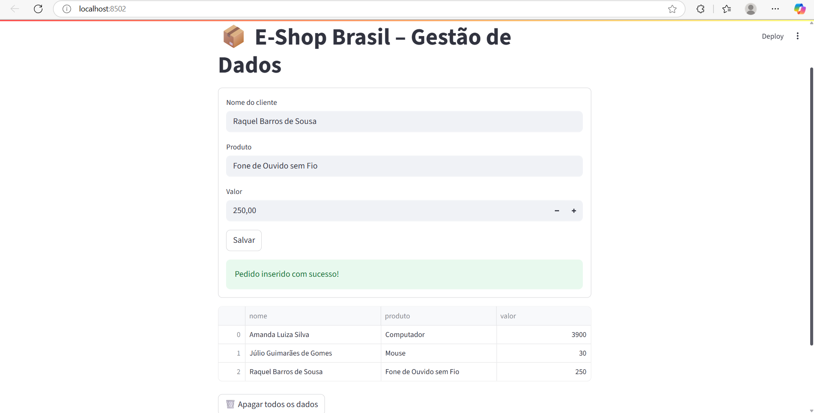
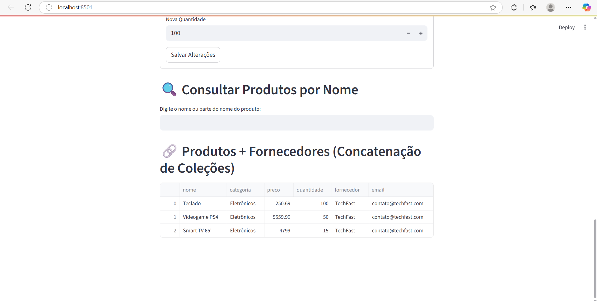
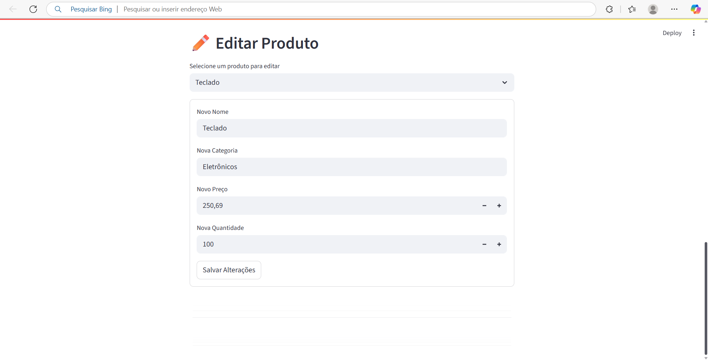
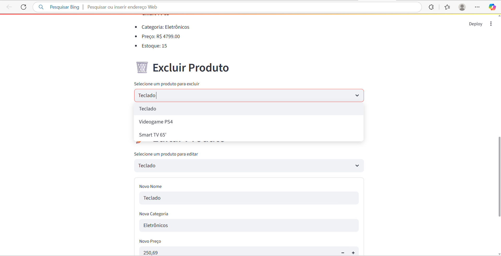
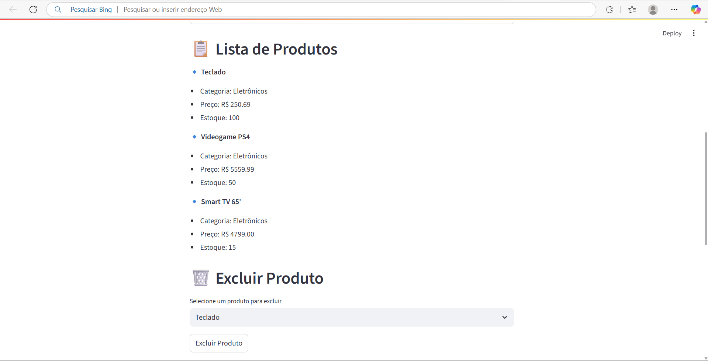

# E-Shop Brasil – Solução com MongoDB e Streamlit

## 🛍️ Contexto
A E-Shop Brasil enfrenta desafios na gestão de dados e logística. Este projeto aplica tecnologias de Banco de Dados Relacional, NoSQL e Big Data para oferecer uma solução escalável, segura e eficiente.

## 🎯 Objetivo
Criar uma aplicação prática que:
- Armazene e manipule dados de clientes/pedidos.
- Permita análise e concatenação de dados.
- Garanta escalabilidade e segurança usando MongoDB (NoSQL) e Streamlit.
- Utilize Docker para ambiente padronizado.

## 🧱 Tecnologias Usadas
- MongoDB via Docker
- Python + Streamlit
- Docker/Docker Compose
- Pandas
- pymongo

## ⚙️ Como Executar

1. **Clone o repositório**  
   ```bash
   git clone https://github.com/seuusuario/e-shop-brasil.git
   cd e-shop-brasil


## Exemplos de Funcionalidades

### Inserção de Produto



### Consulta de Produtos



### Edição de Produtos


### Exclusão de Produtos


### Listagem de Produtos

